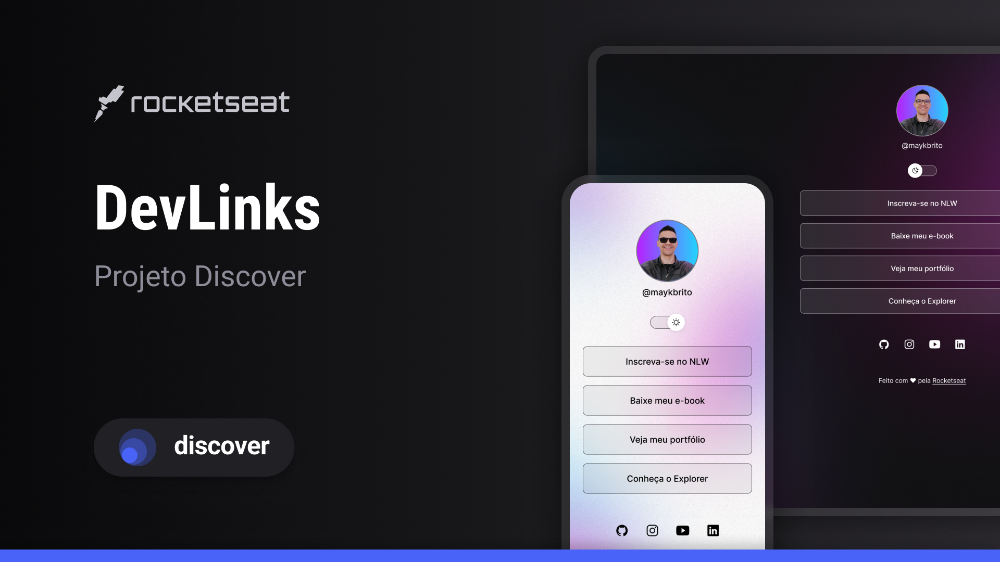

<h1 align="center"> Projeto DevLinks </h1>

 Projeto exclusivo e gratuito, promovido pela Rocketseat para ensino de tecnologias WEB.

  <a href="#-tecnologias">Tecnologias</a>&nbsp;&nbsp;&nbsp;|&nbsp;&nbsp;&nbsp;
  <a href="#-projeto">Projeto</a>&nbsp;&nbsp;&nbsp;|&nbsp;&nbsp;&nbsp;
  <a href="#-layout">Layout</a>&nbsp;&nbsp;&nbsp;|&nbsp;&nbsp;&nbsp;
  <a href="#memo-licença">Licença</a>

  

 

  

## 🚀 Tecnologias

Esse projeto foi desenvolvido com as seguintes tecnologias:

- HTML e CSS
- JavaScript
- Git e Github
- Figma

## 💻 Projeto

O Discover é um projeto agregador de links para usar como cartão de visitas online.

## 🔖 Layout

Você pode visualizar o layout do projeto através [DESSE LINK](<https://www.figma.com/design/2xL1GneCedoPa88tezdguf/DevLinks-%E2%80%A2-Projeto-Discover-(Community)?node-id=0-1&node-type=canvas&t=EHDr2VDF3HbDibJs-0>). É necessário ter conta no [Figma](https://figma.com) para acessá-lo.

## :memo: Licença

Este projeto está licenciado sob a <a href="https://mit-license.org/">licença MIT</a>

---

# Discover

Desenvolvido com ♥ por <a href= "https://app.rocketseat.com.br" >Rocketseat</a> :wave: [Participe da comunidade!](https://discord.gg/rocketseat)
